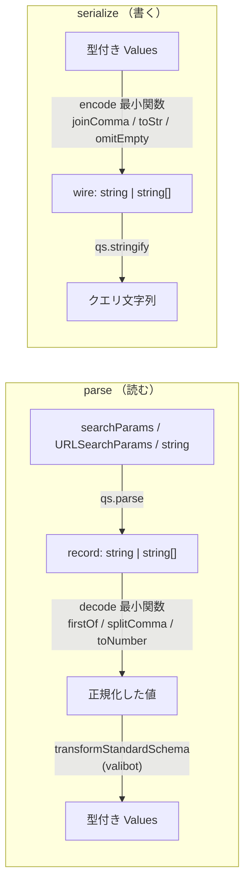
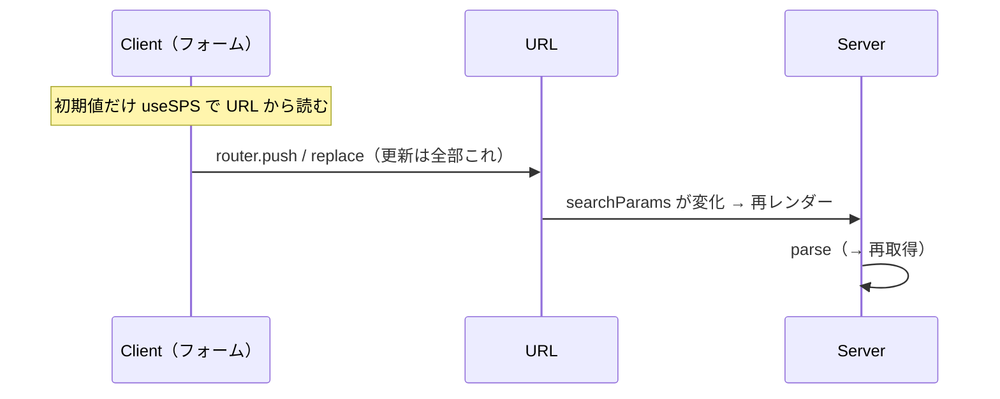
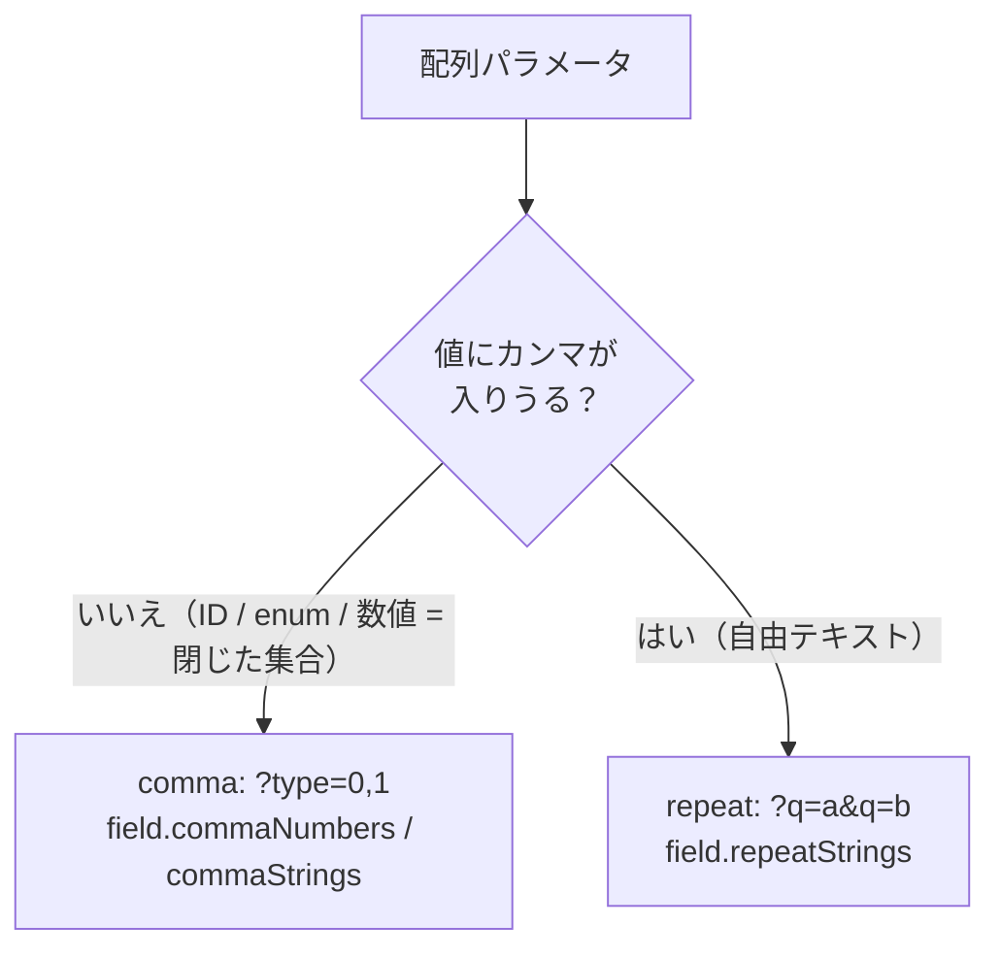

# search-params

URL のクエリ（`searchParams`）を **1 つの schema** から型安全に読み書きするための薄いレイヤ。
サーバー・クライアント・API 呼び出しが同じ定義を共有する。

- **decode（読む）**: `searchParams` → 型付きの値
- **encode（書く）**: 型付きの値 → クエリ文字列
- **検証ライブラリ非依存**: [Standard Schema](https://standardschema.dev) 越しに valibot を使う（zod / arktype に差し替え可能）

---

## Quick start

```ts
// features/users/search-schema.ts
import { createSearchParams } from "@/lib/search-params/factory"
import { field } from "@/lib/search-params/field"
import { USER_ROLES, USER_STATUSES } from "./types"

export const userSearchSchema = createSearchParams({
  q: field.string(), // 自由テキスト（単一）
  role: field.enums(USER_ROLES), // optional: UserRole | undefined（未設定は URL から省略）
  status: field.enums(USER_STATUSES), // optional
  sort: field.enums(["name", "-created"], "name"), // required: default 付き
  page: field.number(1),
})
```

```tsx
// Server: searchParams を decode して描画する
const values = userSearchSchema.parse(await props.searchParams)
const { users } = await getUsers(values)
```

```tsx
// Client: フォームを URL に同期する（"use client"）
const [filters, setFilters] = useSearchParamsState(userSearchSchema, {
  history: "replace",
})
setFilters({ role: "admin", page: 1 })
```

> `sort: "-created"` の先頭 `-` は **降順** を表す慣習（JSON:API / Django 等と同じ。`name`=昇順、`-created`=作成日の新しい順）。

---

## アーキテクチャ

`createSearchParams(schema)` は schema 1 つから `parse` / `serialize` を生やす。
中身は「小さな純粋関数の合成 + valibot 実行器」で構成される。

| モジュール                     | 役割                                                                                                              |
| ------------------------------ | ----------------------------------------------------------------------------------------------------------------- |
| `decode.ts`                    | decode 最小関数（`firstOf` / `splitComma` / `toNumber` / `oneOf` …）。qs の生値を正規化                           |
| `transform-standard-schema.ts` | 任意の Standard Schema（valibot 等）を同期実行する薄い runner                                                     |
| `encode.ts`                    | encode 最小関数（`joinComma` / `toStr` / `omitEmpty` …）                                                          |
| `field.ts`                     | フィールド定義（`field.string` / `number` / `enums` / `commaNumbers` …）。decode（valibot）と encode をペアで持つ |
| `factory.ts`                   | `createSearchParams` 本体。`parse` / `serialize`。qs で入出力を正規化                                             |
| `use-search-params-state.ts`   | クライアントフック。現在値の読み取り + URL 更新                                                                   |



decode と encode は **非対称・lossy**（`[0,1] → "0,1"`、`Date → string` 等）なので、
自動で逆算せず **明示的にペア** で持つ。

---

## Server / Client 境界

**URL が単一の真実（single source of truth）。** サーバーとクライアントは互いに値を props で
渡さず、各自が URL を読む。

- **レンダリング時の参照はすべて Server。** 表示に使う値は Server が `parse(searchParams)`
  から得る。searchParams を読むので動的＝**URL が変わるたびに再レンダー** する。
- **Client が持つのは form の「初期値」だけ。** 初期値を `useSearchParamsState` で URL から読み、
  以降の更新は **すべて `router.push` / `replace`**（= URL への書き戻し）で行う。独自の状態
  ストアは持たない。



---

## 規約

### 配列は comma か repeat か



閉じた集合（`type` / `size` / `status` …）は **comma**（`?type=0,1`）で読みやすく短く。
値自身にカンマが入りうる自由テキストは **repeat**（`?q=a&q=b`）。
`type[]=` のような bracket 形式は使わない。

### optional / required フィールド

`field.enums(allowed)` に **default を渡さなければ optional**（`T | undefined`、未設定は URL から
省略）。default を渡すと required（未設定は default）。`"all"` のような番兵文字列は使わない。

```ts
role: field.enums(USER_ROLES) //         UserRole | undefined
sort: field.enums(SORT, "name") //       SortKey（常に値あり）
```

---

## 設計判断と却下した案

| 採用                                                | 却下 / 比較                                   | 理由                                                                                                                               |
| --------------------------------------------------- | --------------------------------------------- | ---------------------------------------------------------------------------------------------------------------------------------- |
| **valibot** + Standard Schema で疎結合              | zod / arktype / Effect Schema                 | 軽量・tree-shakeable・**将来差し替え可**。zod は longevity / bundle が不安、arktype は構文学習コスト、Effect は重い                |
| **closure factory**（`createSearchParams().parse`） | flat 関数（`parseSearchParams(schema, …)`）   | 1 オブジェクトを持ち回れて、`field.*` とも一貫。flat は schema を毎回手渡す                                                        |
| **encode / decode を明示ペア**                      | decode から encode を自動逆算（双方向 codec） | 変換は lossy・非対称。Standard Schema が標準化するのは decode 方向だけ                                                             |
| **comma 区切り**                                    | bracket（`type[]=`）/ repeat 一択             | comma はどの言語でも読める。bracket は PHP/Laravel 由来の都合。例外（値にカンマ）だけ repeat に逃がす                              |
| **optional field**（`T \| undefined`）              | `"all"` 番兵                                  | 「未設定」を型で表す。番兵は 3 層（schema / API / UI）に漏れる                                                                     |
| **自前実装**                                        | [nuqs](https://nuqs.47ng.com)                 | nuqs は URL↔state の **配管** は担うが検証層は持たない。valibot による coerce / validation と Standard Schema 差し替えが欲しかった |
| **barrel 不使用**（直接 import）                    | `index.ts` 集約                               | Server/Client 境界の漏れ・モジュールグラフ肥大・循環を避ける                                                                       |

---

## 堅牢性メモ

- **攻撃的な入力に強い**: `?a[b]=1` のようなブラケットキーで qs がネストした object を吐いても、
  decode 最小関数（`firstOf` / `splitComma` 等）が非文字列を握りつぶし、throw せず fallback する。
- **throw の正規化**: `transformStandardSchema` は schema 内の同期 throw も `SearchParamsError` に
  揃え、生の `TypeError` を境界の外に漏らさない。
- **メモ化**: `useSearchParamsState` は URL が変わらない限り `parse` 結果と setter の identity を
  保つ（不要な再 parse / 子の再レンダーを避ける）。
